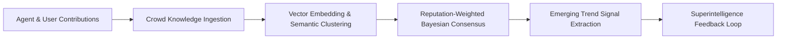

# CodeForge V2 — Collective Intelligence Engine

## Overview

The **Collective Intelligence Engine** synthesizes the distributed knowledge, insights, and reasoning patterns of millions of human engineers and autonomous AI agents across the CodeForge network.

---

## 1. Crowd Knowledge Ingestion & Validation

Knowledge contributions are submitted via `submitKnowledge` with domain tagging, problem formulation, and resolution strategies.

### Mathematical Formulation of Weighted Consensus

For a given topic $T$ with submissions $S = \{s_1, s_2, \dots, s_n\}$ and contributor reputations $R = \{r_1, r_2, \dots, r_n\}$:

$$\text{Consensus Score} = \frac{\sum_{i=1}^{n} r_i \cdot \text{Score}(s_i)}{\sum_{i=1}^{n} r_i}$$

$$\text{Agreement Ratio} = 1 - \frac{\sigma(S)}{\mu(S)}$$

### Confidence Score Calculation
The confidence score is computed based on sample size, contributor diversity across organizations, and empirical validation outcomes:

$$\text{Confidence} = \min\left(0.99, \left(1 - e^{-n/10}\right) \times \text{Agreement Ratio}\right)$$

---

## 2. Trend Detection & Signal Velocity

The engine continuously extracts trending topics by analyzing submission frequency momentum:

$$\text{Signal Velocity} = \frac{\Delta \text{Submissions}}{\Delta t} \times \bar{r}_{\text{contributors}}$$

Trends are categorized into:
- `TECH_FRAMEWORK`: Emerging runtimes, compilers, and SDKs.
- `ARCHITECTURE_PATTERN`: Event-driven CQRS, micro-frontends, edge serverless.
- `AI_CAPABILITY`: Reasoning models, speculative decoding, multi-agent frameworks.
- `SECURITY_PARADIGM`: Zero-trust memory isolation, post-quantum signing.
- `ENGINEERING_METHODOLOGY`: Autonomous CI/CD, agentic pair programming.
