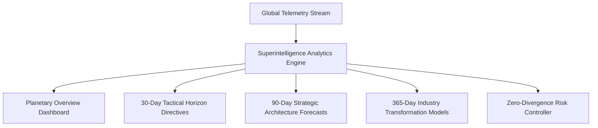

# CodeForge V2 — Executive Superintelligence Layer

## Overview

The **Executive Superintelligence Layer** provides planetary-scale situational awareness, long-range strategic synthesis, and systemic risk mitigation for technology leaders.

---

## 1. Multi-Horizon Strategic Insight Synthesis

The superintelligence layer continuously projects future technology horizons:

- **Near-Term (30 Days)**: Tactical optimizations, automated code review bottlenecks, test flakiness mitigation.
- **Mid-Term (90 Days)**: Architectural migrations (e.g., transition to WebAssembly micro-kernels, serverless GPU scaling).
- **Long-Term (365 Days)**: Industry disruption forecasts, autonomous software workforce expansion, quantum-resilient infrastructure.

---

## 2. Systemic Risk Mitigation

The engine monitors:
1. **Network Partition Resilience**: Verifies graph consistency across cross-regional clusters.
2. **Compute Squeeze Protection**: Automatically activates secondary spot instance pools when compute demand surges past 85%.
3. **Agent Alignment Drift**: Detects divergent decision patterns across enterprise workforces and re-anchors to organization guidelines.
