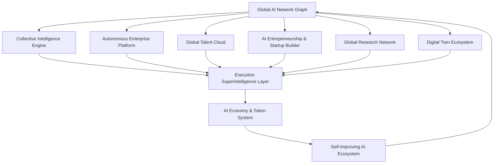

# CodeForge V2 — Phase 16: Global AI Ecosystem Architecture

## 1. Executive Summary

Phase 16 transforms **CodeForge V2** from an AI Operating System into a **Global AI Ecosystem Platform** — a planet-scale intelligence network where millions of users, enterprises, universities, agents, and digital twins interconnect.

---

## 2. Core Architecture Modules

### Module 1: Global AI Network (`backend/src/modules/global-network/globalNetworkService.ts`)
- **Heterogeneous Graph Topology**: Supports nodes of type `USER`, `ORGANIZATION`, `UNIVERSITY`, `AGENT`, `TALENT`, and `KNOWLEDGE`.
- **Edge Traversal & Discovery**: Graph edges capture `COLLABORATES_WITH`, `HIRED_BY`, `RESEARCHES`, `INVESTED_IN`, `TWINNED_WITH`, and `LEARNS_FROM`.
- **Ranking Engine**: Dynamic PageRank and Hub-and-Authority calculations for community influence, enterprise velocity, and research impact.
- **Cross-Network Recommendations**: Semantic and topology-aware link prediction with multi-tenant zero-trust filtering.

### Module 2: Collective Intelligence Engine (`collectiveIntelligenceService.ts`)
- **Crowd Knowledge Synthesizer**: Ingests, normalizes, and embeds multi-agent and community insights.
- **Democratic & Weighted Consensus**: Bayesian aggregation with reputation-weighted voting, variance calculation, and confidence scoring.
- **Trend Detection Engine**: Real-time identification of technology framework surges, architectural pattern shifts, and methodology paradigms.

### Module 3: Autonomous Enterprise Platform (`autonomousEnterpriseService.ts`)
- **Digital Department Instantiation**: Autonomous Engineering, Product, Security, Research, Talent, and Finance departments.
- **Continuous Enterprise Optimization**: Automated velocity monitoring, bottleneck detection, and organizational self-tuning.
- **Autonomous Project Execution**: Multi-agent task decomposition, milestone tracking, and autonomous delivery verification.

### Module 4: Global Talent Cloud (`talentCloudService.ts`)
- **Universal Talent Profiles**: Cross-network developer reputation, verified skill matrix, portfolio scores, and availability status.
- **Skill Verification Engine**: Algorithmic challenge proofs and cryptographically signed skill credentials.
- **Semantic Job Matching**: Multidimensional alignment considering technical mastery, cultural dynamics, and budget requirements.

### Module 5: AI Entrepreneurship & Startup Builder (`startupBuilderService.ts`)
- **Venture Incubation Pipeline**: Automated pitch generation, market landscape mapping, and TAM/SAM/SOM financial models.
- **Co-Founder Matching Matrix**: Skill-complementary and personality-aligned founder pairing.
- **Venture Intelligence Radar**: Real-time competitive dynamics, moat valuation, and funding readiness scoring.

### Module 6: Global Research Network (`researchNetworkService.ts`)
- **Open Scientific Publishing**: Decentralized peer-review workflows, reproducible compute environment snapshots, and open paper archives.
- **Citation Momentum Tracker**: Time-decayed citation velocity and influential academic graph analysis.
- **Emerging Trend Radar**: Citation velocity monitoring to highlight breakthroughs in AI, distributed consensus, and quantum-safe cryptography.

### Module 7: Digital Twin Ecosystem (`digitalTwinService.ts`)
- **Enterprise & Agent Virtualization**: Real-time state synchronization for organizations, workflows, and individual software agents.
- **Monte Carlo Predictive Simulations**: Horizon stress testing (1–90 days) evaluating operational throughput, failure probability, and cost volatility.
- **Optimal State Synthesis**: Counterfactual optimization recommending strategic architectural changes.

### Module 8: AI Economy & Token System (`ecosystemEconomyService.ts`)
- **Skill Credit Rewards**: Tokenized utility rewards for peer review, knowledge contributions, and verified solution publishing.
- **Reputation Tier Progression**: Automated promotion across `CONTRIBUTOR`, `FELLOW`, `PRINCIPAL`, and `LUMINARY` tiers.
- **Dynamic Compute Exchange**: Algorithmic compute token exchange rates driven by real-time GPU/CPU cluster utilization.

### Module 9: Self-Improving AI Ecosystem (`selfImprovingEcosystemService.ts`)
- **Ecosystem Evolution Engine**: Automated prompt evolution, tool synthesis, and agent fine-tuning loops.
- **Fitness Telemetry & Drift Detection**: Automated benchmarking measuring accuracy improvement, latency reduction, and token efficiency.

### Module 10: Executive Superintelligence Layer (`superIntelligenceService.ts`)
- **Planetary Telemetry Aggregation**: Global telemetry spanning active nodes, compute utilization, consensus agreements, and venture creation.
- **Strategic Horizon Insights**: 30, 90, and 365-day strategic predictions with actionable executive directives.
- **Systemic Risk Evaluation**: Anomaly mitigation, catastrophic divergence prevention, and organizational resilience enforcement.

---

## 3. Database Layer (`backend/src/database/schema/global_ecosystem.ts`)
15 normalized PostgreSQL tables with foreign key constraints, indexes, and cascades:
1. `global_network_nodes`
2. `global_network_edges`
3. `crowd_knowledge_submissions`
4. `collective_consensuses`
5. `trend_signals`
6. `autonomous_departments`
7. `autonomous_enterprise_projects`
8. `talent_profiles`
9. `verified_skills`
10. `incubated_startups`
11. `research_publications`
12. `research_citations`
13. `digital_twins`
14. `digital_twin_simulations`
15. `ecosystem_reputations`

---

## 4. Frontend Portals
- `/global-command-center`: Planetary Command Center & Superintelligence HUD
- `/global-network`: Interactive Global Knowledge & Organization Graph
- `/talent-cloud`: Global Verified Talent Marketplace
- `/research-network`: Scientific Paper Publishing & Trend Radar
- `/startup-builder`: Autonomous AI Incubator & Co-Founder Matcher
- `/digital-twins`: Enterprise Simulation & Virtualization Console
- `/ecosystem-analytics`: Token Economy, Compute Exchange & Evolution Metrics
