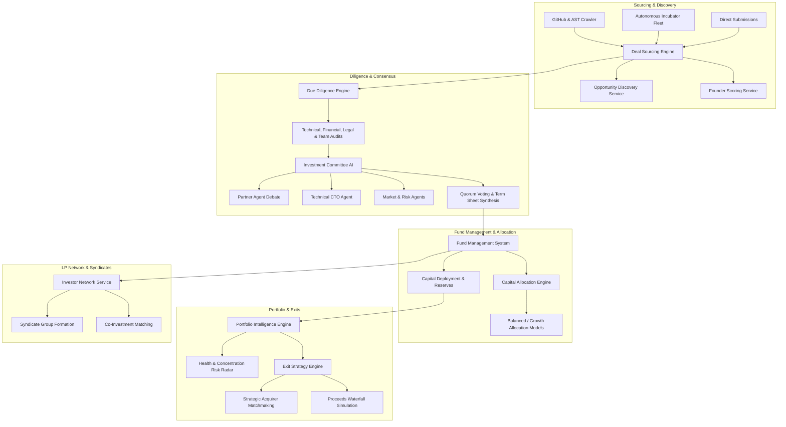

# Phase 21: Venture Capital Intelligence & Autonomous Investment Network
## System Architecture & Technical Specifications

### 1. Executive Overview

Phase 21 elevates CodeForge from an Autonomous Startup Builder into a full-scale institutional **Venture Capital Intelligence Platform & Autonomous Investment Network**. It provides end-to-end cognitive infrastructure for automated deal sourcing, multidimensional due diligence, multi-agent investment committee consensus, fund accounting & reserve management, portfolio risk telemetry, exit waterfall modeling, and LP syndicate coordination.

---

### 2. Core Architectural Components

| Subsystem | Service Name | Key Responsibilities |
|---|---|---|
| **Deal Sourcing Engine** | `DealSourcingService` | Discovers startups across GitHub, AST graphs, and incubator telemetry; manages Kanban deal pipeline. |
| **Opportunity Discovery** | `OpportunityDiscoveryService` | Evaluates total addressable market (TAM), compound annual growth rate (CAGR), and defensibility moats. |
| **Founder Scoring** | `FounderScoringService` | Scores founder technical depth, execution velocity, resilience, and domain alignment. |
| **Autonomous Due Diligence** | `DueDiligenceService` | Evaluates team, architecture, market, financials, and compliance; flags risks and red flags. |
| **Investment Committee AI** | `InvestmentCommitteeService` | Multi-agent partner debates, conviction score synthesis, quorum-based voting, and term sheets. |
| **Fund Management System** | `FundManagementService` | Tracks fund vehicles, LP capital calls, deployment velocity, reserves, DPI, TVPI, and Gross/Net IRR. |
| **Portfolio Intelligence** | `PortfolioIntelligenceService` | Computes Sharpe/Sortino ratios, sector concentration matrices, and health risk radars. |
| **Exit Strategy Engine** | `ExitStrategyService` | Simulates strategic M&A and IPO exits with LP/GP waterfall distributions and liquidity forecasts. |
| **Investor Network** | `InvestorNetworkService` | LP directory, check-size matchmaking, and collaborative syndicate formation. |
| **Capital Allocation Engine** | `CapitalAllocationService` | Dynamic capital allocation across initial checks, follow-on reserves, and contingency buffers. |

---

### 3. Data Flow & Security Model

All venture capital operations enforce strict multi-tenant isolation, cryptographically validated audit logging, and role-based access control (RBAC).
- **Admins & Partners**: Full write/approve capabilities across funds, committees, and capital deployment.
- **Analysts**: Diligence generation, opportunity discovery, and deal notes.
- **Limited Partners**: View-only access to fund performance metrics, distribution waterfalls, and co-investment syndicates.
