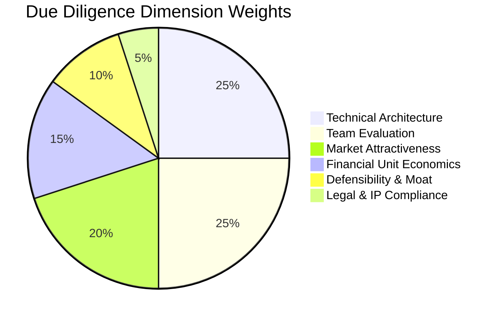

# Phase 21: Deal Sourcing Engine & Autonomous Due Diligence

## 1. Deal Sourcing & Pipeline Architecture

The **Deal Sourcing Engine** proactively monitors autonomous incubators, developer networks, and code repository signals to surface outlier startup ventures before traditional venture capital channels.

### Pipeline Stages
- **Inbox**: Raw discoveries and unsolicited submissions awaiting screening.
- **Screening**: Algorithmic scoring of team credentials, market TAM, and code repository traction.
- **First Call**: Initial thesis alignment and technical interview.
- **Due Diligence**: Exhaustive deep-dive multi-vector audit.
- **Partner Meeting**: Formal presentation to GP committee.
- **Term Sheet**: Negotiating valuation, ownership, and governance terms.
- **Legal Closing / Invested**: Executed financing and wire distribution.

---

## 2. Multidimensional Due Diligence Evaluation

The `DueDiligenceService` automates technical, legal, and financial audits across 6 specialized dimensions:

### Risk Detection & Mitigations
- **High Severity Red Flags**: Legal title ambiguity, regulatory exposure, or extreme technical debt.
- **Moderate Risks**: GPU compute cost scaling, customer concentration, or key-person dependencies.
- **Automated Mitigations**: Tailored covenants, milestone-based disbursements, and key hire requirements.
