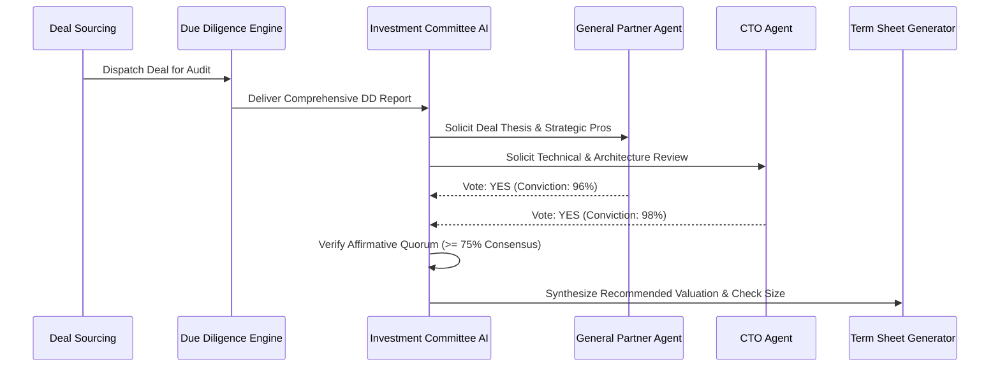

# Phase 21: Investment Committee AI & Decision Consensus

## 1. Multi-Agent Committee Structure

The `InvestmentCommitteeService` models a high-conviction venture capital partner meeting using specialized AI agents representing distinct viewpoints:

1. **Lead Deal Sponsor Agent**: Advocates for market upside, outlier return potential, and strategic alignment.
2. **Technical CTO Agent**: Audits mathematical rigor, architecture latency, codebase maintainability, and scalability bottlenecks.
3. **Market Economist Agent**: Evaluates competitive density, pricing power, regulatory headwinds, and buyer personas.
4. **Financial Risk Agent**: Stress tests valuation multiples, burn rates, dilution models, and liquidation preferences.

---

## 2. Quorum Voting & Conviction Synthesis

### Recommendation Outcomes
- `STRONG_INVEST`: Unanimous or super-majority affirmative vote; initiate top-tier term sheet.
- `INVEST`: Solid positive quorum with standard covenants.
- `CONDITIONAL_INVEST`: Requires affirmative resolution of specific milestones or board observer seats.
- `HOLD` / `PASS`: Significant unmitigated red flags or misaligned valuation expectations.
