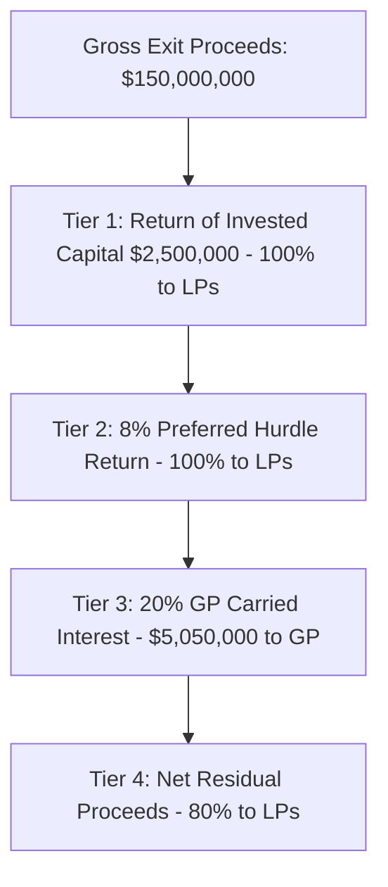

# Phase 21: Exit Strategy Engine & Waterfall Proceeds Simulation

## 1. Exit Modeling Architecture

The `ExitStrategyService` simulates liquidity outcomes across strategic M&A acquisitions, Initial Public Offerings (IPO), secondary sales, and share buybacks.

### Multi-Horizon Liquidity Forecasting
- **12-Month Horizon**: Near-term M&A tuck-ins and secondary liquidity blocks.
- **24-Month Horizon**: Strategic enterprise acquisitions with 10x+ MOIC multiples.
- **36-Month Horizon**: Large-scale IPO registrations on major stock exchanges.

---

## 2. Waterfall Distribution Structure

### Strategic Acquirer Matchmaking
The engine maintains active semantic and commercial fit matrices with major enterprise titans (e.g. OmniCloud Corp, HyperScale Enterprise) to generate real-time acquisition synergies and offer ranges.
