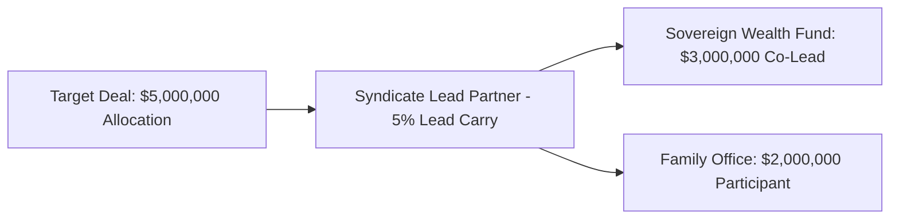

# Phase 21: Investor Network & LP Syndicates

## 1. Limited Partner Management

The `InvestorNetworkService` manages institutional allocators, sovereign wealth funds, family offices, and university endowments.

### Key Capabilities
- **Allocator Profiles**: Check size ranges ($1M–$50M), preferred startup sectors, and historical deployment velocity.
- **Relationship Health**: Real-time engagement score tracking reporting cadence, meeting participation, and co-investment appetite.

---

## 2. Collaborative Syndicate Formation

### Syndicate Roles
- `LEAD_INVESTOR`: Sets deal terms, negotiates allocations, and earns syndicate lead carry.
- `CO_LEAD`: Major check contributor with board observer or strategic advisory rights.
- `PARTICIPANT`: Standard LP co-investor participating in pro-rata allocation blocks.
