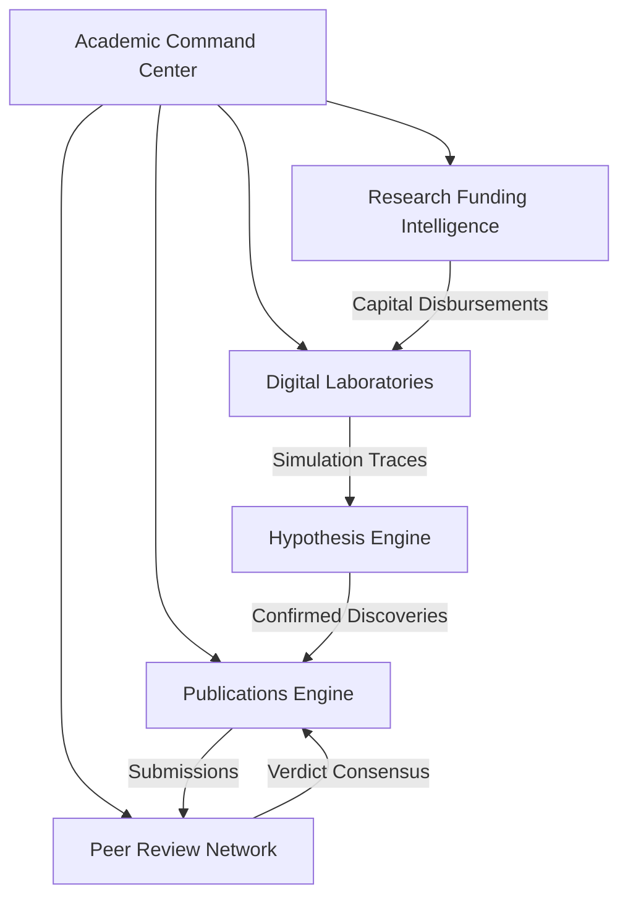

# 01-Autonomous Research University Architecture

This document describes the high-level architecture of the **CodeForge Autonomous Research University**.

## Architectural Subsystems

1. **Academic Programs & Project Coordination**: Coordinates research projects across 8 departments: Mathematics, Physics, Chemistry, Biology, Computer Science, Artificial Intelligence, Engineering, Medicine.
2. **Scientific Discovery & Hypothesis Engine**: Employs continuous verification cycles to compute theory novelty and feasibility.
3. **Digital Laboratories & Virtual HPC Clusters**: Tracks compute capacity utilization, mounted dataset arrays, and schedules simulation runs.
4. **Academic Knowledge Graph Civilization**: Indexes theorems, algorithms, datasets, and concepts with evolutionary lineages.
5. **Publications & Peer Review Engine**: Dispatches submissions to peer reviewers, computes verdict consensus, and logs citations.
